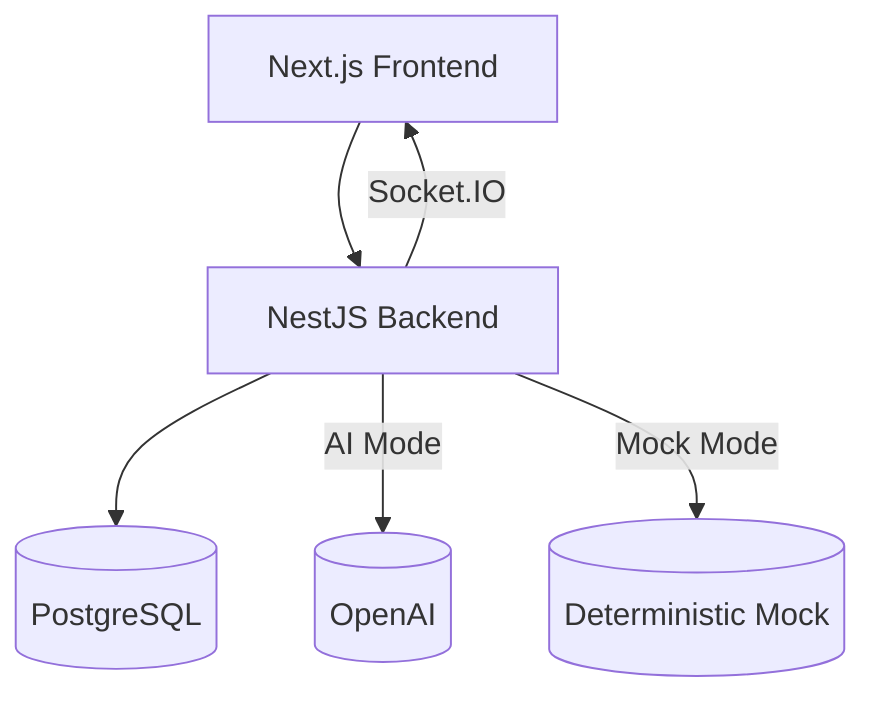
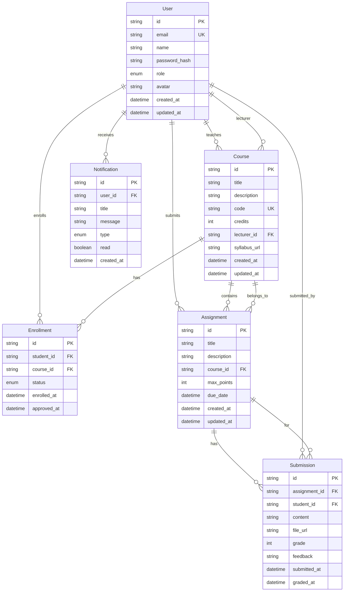
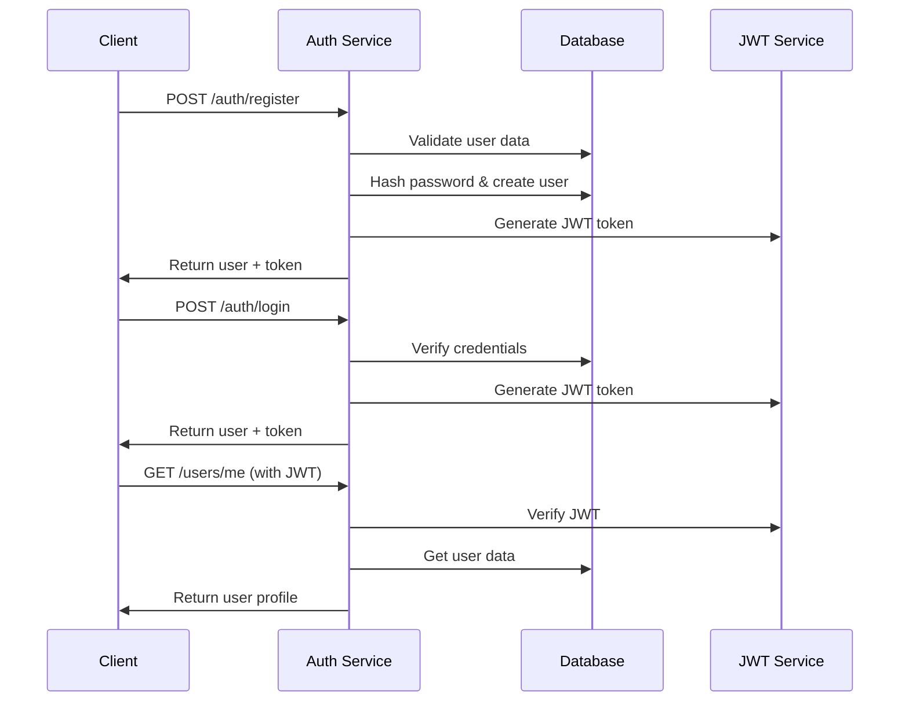
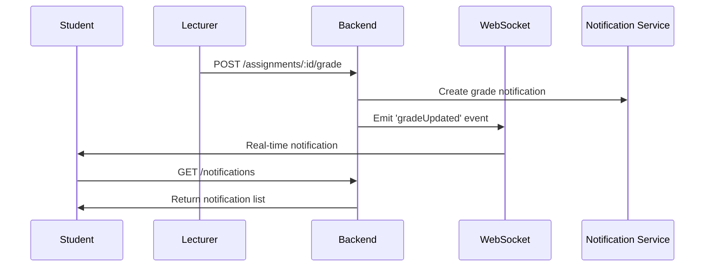
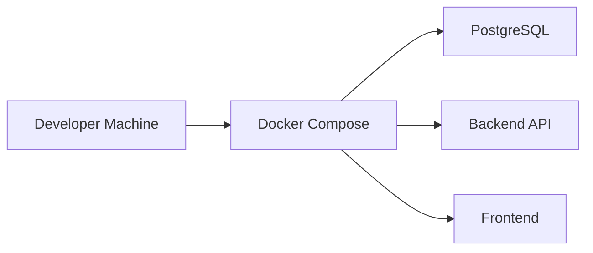
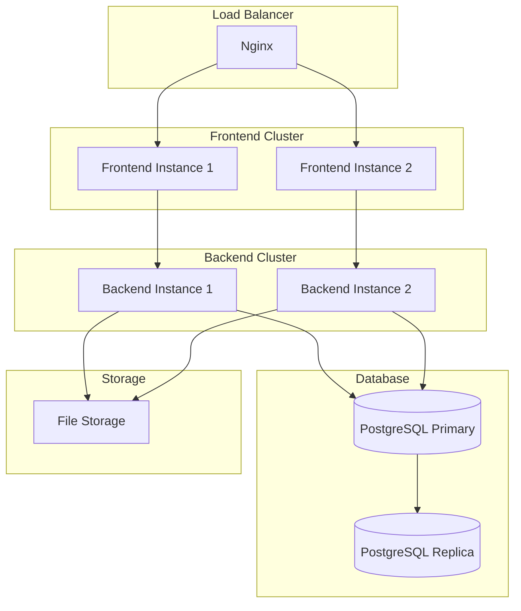

# ExcelMind CRM - System Design

## Architecture Overview

ExcelMind CRM is a fullstack academic management platform built with modern web technologies, designed to handle university academic workflows with role-based access control, real-time features, and AI integration.

## System Architecture

## Technology Stack

### Frontend
- **Next.js 14** - React framework with App Router
- **TypeScript** - Type safety and better developer experience
- **TailwindCSS** - Utility-first CSS framework
- **shadcn/ui** - Reusable component library
- **Framer Motion** - Animation library
- **Zustand** - Lightweight state management
- **React Query** - Data fetching and caching
- **Socket.IO Client** - Real-time communication

### Backend
- **NestJS v10** - Scalable Node.js server framework
- **Prisma ORM** - Type-safe database toolkit
- **PostgreSQL** - Relational database
- **JWT** - Stateless authentication
- **Socket.IO** - Real-time bidirectional communication
- **PDFKit** - PDF generation
- **bcrypt** - Password hashing
- **class-validator** - DTO validation

### Infrastructure
- **Docker** - Containerization
- **Docker Compose** - Multi-container orchestration
- **Nginx** - Reverse proxy and load balancing

## Database Design

### Core Entities

## API Design

### Authentication Flow

### Real-time Notifications

## Transcript PDF Generation

Flow:
1. Client requests `GET /transcript/:studentId/pdf` with JWT.
2. Backend authorizes (self/admin/lecturer-of-student).
3. Query enrollments, assignments, submissions; compute GPA.
4. Generate PDF with PDFKit; stream as `application/pdf`.

Key details:
- GPA weighted by course credits; letter grades derived from percentage.
- Filename: `transcript_<student>_<id>.pdf`.

## WebSocket Event Flows

- Connection: client connects with JWT (auth header or handshake `auth.token`).
- Rooms: server maps userId → socket and emits directly.
- Events:
  - `enrollmentStatus` (payload: { enrollmentId, status, course })
  - `gradeUpdated` (payload: { assignmentId, submissionId, grade, maxPoints, course })

## Security Architecture

### Authentication & Authorization

1. **JWT-based Authentication**
   - Stateless token-based auth
   - Role-based access control (RBAC)
   - Token expiration and refresh

2. **Password Security**
   - bcrypt hashing with salt rounds
   - Password strength validation
   - Secure password reset flow

3. **API Security**
   - Helmet.js for security headers
   - CORS configuration
   - Rate limiting
   - Input validation with class-validator

4. **File Upload Security**
   - File type validation (PDF/DOCX only)
   - File size limits
   - Secure file storage
   - Virus scanning (future enhancement)

## Performance Considerations

### Frontend Optimization
- **Code Splitting** - Lazy loading of components
- **Image Optimization** - Next.js Image component
- **Caching** - React Query for API caching
- **Bundle Optimization** - Tree shaking and minification

### Backend Optimization
- **Database Indexing** - Optimized queries
- **Connection Pooling** - Prisma connection management
- **Caching** - Redis for session storage (future)
- **CDN** - Static asset delivery

### Real-time Performance
- **WebSocket Scaling** - Horizontal scaling with Redis adapter
- **Event Batching** - Batch notifications for efficiency
- **Connection Management** - Proper cleanup and reconnection

## Deployment Architecture

### Development Environment

### Production Environment

## Monitoring & Logging

### Application Monitoring
- **Health Checks** - API endpoint monitoring
- **Performance Metrics** - Response time tracking
- **Error Tracking** - Centralized error logging
- **User Analytics** - Usage pattern analysis

### Infrastructure Monitoring
- **Database Performance** - Query optimization
- **Server Resources** - CPU, Memory, Disk usage
- **Network Monitoring** - Latency and throughput
- **Container Health** - Docker container monitoring

## Scalability Considerations

### Horizontal Scaling
- **Stateless Backend** - Easy horizontal scaling
- **Database Sharding** - Future database partitioning
- **CDN Integration** - Global content delivery
- **Microservices** - Future service decomposition

### Vertical Scaling
- **Resource Optimization** - Efficient resource usage
- **Database Tuning** - Query and index optimization
- **Caching Strategy** - Multi-level caching
- **Connection Pooling** - Database connection management

## Future Enhancements

### Phase 2 Features
- **Mobile App** - React Native application
- **Advanced Analytics** - Learning analytics dashboard
- **Integration APIs** - Third-party system integration
- **Advanced AI** - More sophisticated AI features

### Technical Improvements
- **Microservices Architecture** - Service decomposition
- **Event Sourcing** - Audit trail and event replay
- **CQRS** - Command Query Responsibility Segregation
- **GraphQL** - Flexible API querying

## Conclusion

ExcelMind CRM is designed as a scalable, maintainable, and secure academic management platform. The architecture supports current requirements while providing a foundation for future enhancements and growth. The use of modern technologies and best practices ensures high performance, security, and developer productivity.
